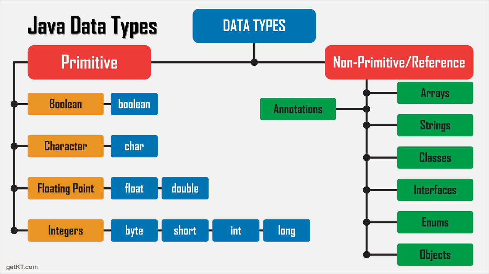
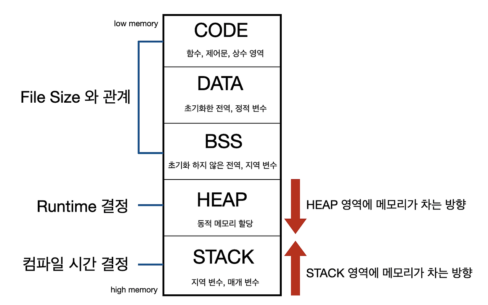
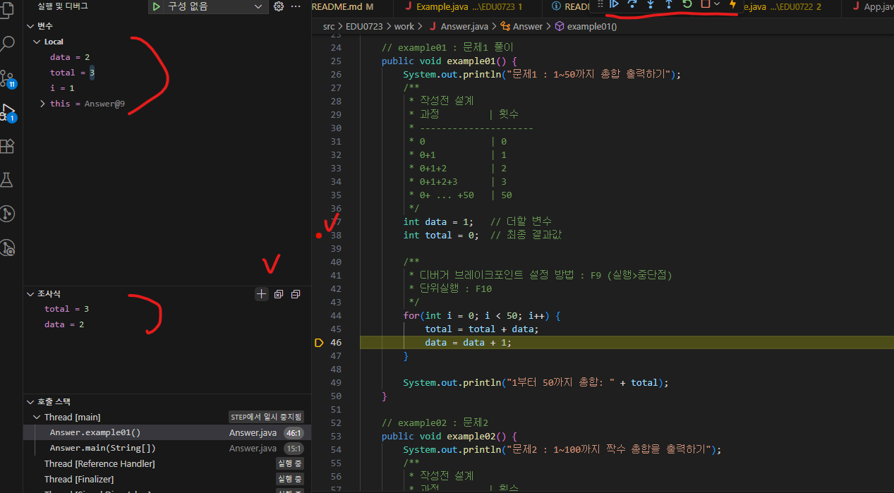

## 자바기초 4일차

### 1. 배열
#### 1.1 배열 선언
```java
/** 배열선언 
 * 'dataType[]'             : 해당 데이터타입을 참조 자료형으로 선언
 * '= new dataType[n]'      : 배열 크기 설정 (n => 양수) 
*/

// 선언하는 방식들
int[] score = new int[5];               // 5칸(0 ~ 4) 할당
score[3] = 40;                          // idx 3에 40 넣음 -> {0,0,40,0,0}
int[] intArr = {1, 2, 3, 4};            
String[] strArr = {"H1", "H2"};    
int[] intArr2 = new int[] {1, 2, 3, 4};            
```

#### 1.2 java의 data type에 대해 
#### 데이터타입

이미지출처 : <https://crowruya.tistory.com/6>
* 기본자료형 (primitive-Types) 
    - 기본 데이터 타입 - ```byte, int, long, char, float ...```
    - 메모리의 Stack 영역에 존재
* 참조자료형 (non-primitive-Types || Referense-Types) 
    - 참조 데이터 타입 - ```Objects, Classes, Arrays, Interfaces, Variables, ...```
    - 메모리의 Heap 영역에 존재하고 다른 메모리에서 heap을 참조함
    - heap ? 할당하거나 할당한 걸 해제하는 동적 메모리 영역 
    - ex: ```int[] arr = new int[5]``` 
        - ```arr``` 은 stack영역 <-> ```new int[5]``` 는 heap 영역 / 즉 new 라는 게 heap에 생성

#### 메모리영역

이미지출처 : [link](https://junghn.tistory.com/entry/%EC%BB%B4%ED%93%A8%ED%84%B0-%EA%B8%B0%EC%B4%88-%EB%A9%94%EB%AA%A8%EB%A6%AC-%EA%B5%AC%EC%A1%B0-%EC%8A%A4%ED%83%9DStack-%ED%9E%99Heap-%EB%8D%B0%EC%9D%B4%ED%84%B0Data%EC%98%81%EC%97%AD)


#### 1.3 같은 동적메모리 참조하는 경우
```java
    int[] arrA = new int[] {10, 20, 30, 40, 50};        
    // arrA  = {10, 20, 30, 40, 50}

    arrA[0]  = 11;
    // arrA  = {11, 20, 30, 40, 50}

    int[] arrB = arrA; 
    // arrA  = {11, 20, 30, 40, 50}
    // arrB  = {11, 20, 30, 40, 50} (같은 메모리 참조됨)

    arrB[0] = 12;
    // arrA  = {12, 20, 30, 40, 50} (arrB를 변경했지만 같은 참조를 바라보고있어서 arrA도 변경됨)
    // arrB  = {12, 20, 30, 40, 50}
``` 
* ```new int[]``` 로 참조 생성시 


### 2. 디버깅
#### 2.1 breck point 걸기 (중단점) 및 디버그 실행

* IDE : VSCODE
    - 중단점 활성 (F9) or (실행>중단점)
    - 단위실행 (F10) or (상단레이어툴바 아이콘버튼확인)
    - 우측 디버그에서 확인가능하며, 조사식에서 원하는 변수만 골라서 확인도 가능 (수식도 가능)

* IDE : 이클립스
    - 소스 line에 숫자 옆 마우스클릭으로 중단점 걸기
    - 디버깅 활성 (F11) or (상단 벌레아이콘)
    - 단위실행 (F6) / 메서드외부이동 (F7) / 다음중단점 (F8)
    - 서치해서 확인해본 내용임.

* IDE : 인텔리제이 
    - 소스 line에 숫자 옆 마우스클릭으로 중단점 걸기
    - 디버깅 활성 (shift + F9) 
    - 단위실행 (F8) / 메서드외부이동 (F7) / 다음중단점 (F9)
    - 서치해서 확인해본 내용임.

ㅡㅡ <br>
실무 용어
* 테스트 드라이버 (test driver) - 상위모듈x / 하위모듈 호출해서 테스트하기 위해 임시로 상위모듈 만들어서 테스트함 (상향식 테스트)
* 테스트 스텁 (test stub) - 하위모듈x / 상위모듈 테스트하기 위해 하위모듈 임시로 만들어서 테스트함 (하향식 테스트)

모듈 확인시 상하위에 따라 테스트 드라이버, 테스트 스텁 방식으로 진행해야 하고, 브레이크 포인트와 프린트린을 활용해 디버깅 확인 함.


### 3. function (method)

#### 3.1 내용


### etc. 자바 외 내용

#### S/W 시장 과정

#### 1980년 : 기업시장 시작
구조적프로그램언어 탄생 (c언어등) <br>
unix <-> 깡통(console)
* input console - 입력 기기 or 창 (키보드, 조이스틱...)
* output console - 출력 기기 or 창 (터미널, 모니터...)

<br>

#### 1990년 : 대 PC의 시대
다양한 하드웨어가 나오면서 그거를 활용한 소프트웨어 우후죽순 나타나는 시기였음 <br>
당시 기업들이 개발자들 대량 투입하였지만 요구사항에 따른 소프트웨어 복잡성과 용량 문제가 생기게 되고, 인력대비 생산력이 떨어져 위기를 느낌 (S/W crisis)<br>
해결하고자 전문학자 등 붙었지만 소프트웨어 복잡성에 대해 해결방안은 경영학자 제시했다 함<br>

##### 복잡성에 따른 언어 개선
단순 구조적 프로그래밍 input -> prosessing -> output 과정에 과한인풋,과한프로세싱,화려한아웃풋이 요구되면서 <br>
스파게티코드가 됨. 해결하기 위해 개선 언어들 탄생 (객체지향적)
* C -> C++ 및 C# 탄생
* java 탄생 등

#### 2000년 : 객체지향 프로그래밍 확립 및 전국 활용

* 기존 : 요구사항 -> 단일S/W -> 응답
* 현재 : 요구사항 -> 여러S/W AI (서로간 통신으로 랭체인 활용등) -> 응답
    * S/W -> java, python 위주
    * AI -> python, C++ (gpu관련) 위주 (* 2020 이후 활용시작함)

<br>
* LLM, MCP, langchain 등 다양한게 있음

#### 2020년 : AI 시작

구글딥마인드, chatGPT, 제미나이 등 인공지능 나타나기 시작 <br>
