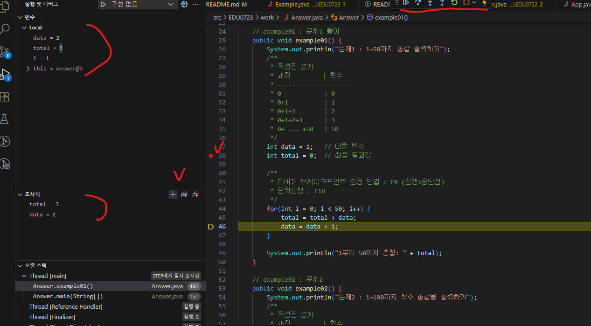

## 자바기초 4일차

### 1. 디버깅
#### 1.1 breck point 걸기 (중단점) 및 디버그 실행

* IDE : VSCODE
    - 중단점 활성 (F9) or (실행>중단점)
    - 단위실행 (F10) or (상단레이어툴바 아이콘버튼확인)
    - 우측 디버그에서 확인가능하며, 조사식에서 원하는 변수만 골라서 확인도 가능 (수식도 가능)

* IDE : 이클립스
    - 소스 line에 숫자 옆 마우스클릭으로 중단점 걸기
    - 디버깅 활성 (F11) or (상단 벌레아이콘)
    - 단위실행 (F6) / 메서드외부이동 (F7) / 다음중단점 (F8)
    - 서치해서 확인해본 내용임.

* IDE : 인텔리제이 
    - 소스 line에 숫자 옆 마우스클릭으로 중단점 걸기
    - 디버깅 활성 (shift + F9) 
    - 단위실행 (F8) / 메서드외부이동 (F7) / 다음중단점 (F9)
    - 서치해서 확인해본 내용임.

ㅡㅡ  
실무 용어
* 테스트 드라이버 (test driver) - 상위모듈x / 하위모듈 호출해서 테스트하기 위해 임시로 상위모듈 만들어서 테스트함 (상향식 테스트)
* 테스트 스텁 (test stub) - 하위모듈x / 상위모듈 테스트하기 위해 하위모듈 임시로 만들어서 테스트함 (하향식 테스트)

모듈 확인시 상하위에 따라 테스트 드라이버, 테스트 스텁 방식으로 진행해야 하고, 브레이크 포인트와 프린트린을 활용해 디버깅 확인 함.

### 2. function (method)

#### 1.1 if문

### etc. 자바 외 내용

#### S/W 시장 과정

#### 1980년 : 기업시장 시작
구조적프로그램언어 탄생 (c언어등)  
unix <-> 깡통(console)
* input console - 입력 기기 or 창 (키보드, 조이스틱...)
* output console - 출력 기기 or 창 (터미널, 모니터...)

 

#### 1990년 : 대 PC의 시대
다양한 하드웨어가 나오면서 그거를 활용한 소프트웨어 우후죽순 나타나는 시기였음  
당시 기업들이 개발자들 대량 투입하였지만 요구사항에 따른 소프트웨어 복잡성과 용량 문제가 생기게 되고, 인력대비 생산력이 떨어져 위기를 느낌 (S/W crisis) 
해결하고자 전문학자 등 붙었지만 소프트웨어 복잡성에 대해 해결방안은 경영학자 제시했다 함 

##### 복잡성에 따른 언어 개선
단순 구조적 프로그래밍 input -> prosessing -> output 과정에 과한인풋,과한프로세싱,화려한아웃풋이 요구되면서  
스파게티코드가 됨. 해결하기 위해 개선 언어들 탄생 (객체지향적)
* C -> C++ 및 C# 탄생
* java 탄생 등

#### 2000년 : 객체지향 프로그래밍 확립 및 전국 활용

* 기존 : 요구사항 -> 단일S/W -> 응답
* 현재 : 요구사항 -> 여러S/W AI (서로간 통신으로 랭체인 활용등) -> 응답
    * S/W -> java, python 위주
    * AI -> python, C++ (gpu관련) 위주 (* 2020 이후 활용시작함)

 
* LLM, MCP, langchain 등 다양한게 있음

#### 2020년 : AI 시작

구글딥마인드, chatGPT, 제미나이 등 인공지능 나타나기 시작  
